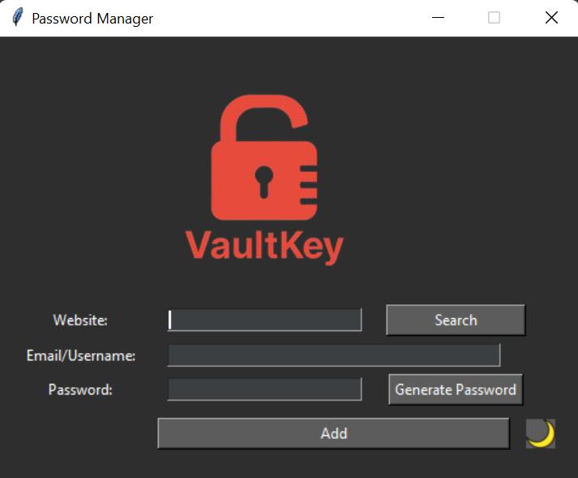
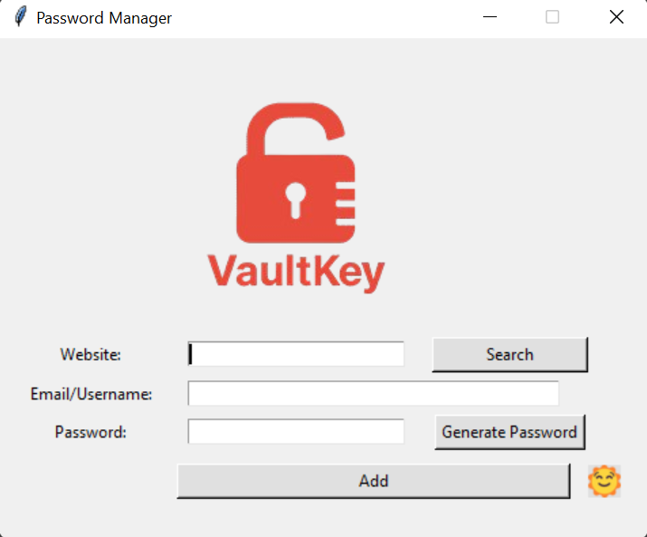

# 🔐 Password Manager App `VaultKey`

A sleek and secure **open-source** desktop password manager called `VaultKey` — with encryption, dark/light mode toggle, clipboard support, and more.


---

# ✨ Features

- 🌙 **Dark Mode & Light Mode** toggle with icon-based switch (🌞 / 🌚)
- 🔐 **AES Encryption** using `cryptography` to securely store passwords
- 🎲 **Strong Password Generator** (letters, symbols, numbers)
- 🔎 **Search Functionality** to retrieve saved credentials by website
- 💾 **Local JSON Storage** (encrypted)
- 📋 **Clipboard Copy** for generated passwords
- 🖼️ Polished **Tkinter GUI** with custom icons and colors
- 💻 Fully compatible with **PyInstaller** for `.exe` packaging

---

## 📸 Screenshots

| Dark Mode                        | Light Mode                         |
|----------------------------------|------------------------------------|
|  |  |

---

## 🗂️ Folder Structure

    VaultKey-Password_manager/
    ├── main.py                   # Main GUI and app logic
    ├── core/
    │   ├── password_logic.py     # PasswordGenerator class
    │   └── crypto_util.py        # Encryptor class for encryption/decryption
    ├── assets/
    │   ├── logo.png              # App logo
    │   ├── sun.png               # Light mode icon
    │   ├── moon.png              # Dark mode icon
    │   └── (no sensitive data)   # password_data.json and secret.key are not stored here
    ├── requirements.txt          # Python dependencies
    ├── README.md                 # You're reading it!
    └── .gitignore                # Prevents sensitive files from being tracked

📁 **Note:** On first run, VaultKey automatically creates and stores:
 - "password_data.json"
 - "secret.key"

in the system folder:
```bush
    C:\Users\<YourUsername>\AppData\Roaming\VaultKey\
```

---

# 🚀 Getting Started


💡 **Pro Tip**:  
Use `python main.py` during development for faster testing. Build the `.exe` only for final deployment or sharing with others.

---


### 1. Clone the repository
    git clone https://github.com/HarshBelekar/VaultKey-Password_manager.git

    cd VaultKey-Password_manager


### 2. Install dependencies
    pip install -r requirements.txt

### 3. Run the app
    python main.py

---

# 🛠 Technologies Used

 -  **tkinter** — GUI framework
 -  **pyperclip** — Clipboard integration
 -  **cryptography** — AES encryption for password security
 -  **json** — Data storage format

---

# 🧪 Build Executable (Windows)

 - Use PyInstaller to convert the app into a standalone executable:

```bash
    python -m PyInstaller --onefile --windowed --icon=assets/logo.ico --add-data "assets;assets" --name VaultKey main.py
```
👉 The .exe file will be located in the dist/ folder after the build.

---

# ⚠️ Antivirus Warning (False Positive)

When building the `VaultKey.exe` file using PyInstaller, some antivirus software (especially **Windows Defender**) might flag the generated `.exe` as a **potential threat**.

This is a **false positive**, triggered by:
- Using **Fernet encryption**
- Saving encrypted JSON files
- Clipboard access via `pyperclip`

---

## 🔧 How I Fixed the Issue

To successfully build the `.exe` without triggering antivirus errors:

1. ⚙️ I **excluded the project folder** from Windows Defender using:
   - Settings → Privacy & Security → Windows Security → Virus & Threat Protection → Manage Settings → **Add Exclusion**

2. 🔄 Rebuilt the `.exe` using PyInstaller:
   ```bash
   python -m PyInstaller --onefile --windowed --icon=assets/logo.ico --add-data "assets;assets" --name VaultKey main.py
   ```

---

# 🛡️ Security Notes

 - All saved passwords are **encrypted** using a secure **Fernet key (AES-128)** via the `cryptography` library.

 - The encryption key (`secret.key`) and your password data (`password_data.json`) are stored **outside the project folder** in a protected system location (see below).

 - These files are **excluded from Git tracking** using `.gitignore` to ensure your credentials remain private.

---

# 📂 Data Storage Location

**VaultKey** stores sensitive data in the user's system directory, not in the `assets/` folder.

### 📍 Windows Location:
    C:\Users\<YourUsername>\AppData\Roaming\VaultKey\

### Files stored there:

 - **password_data.json** → Encrypted password data
 - **secret.key** → Your encryption key (do not delete unless resetting)

### This ensures:

 - Compatibility with `.exe` builds where asset folders are read-only
 - Secure, writable file handling for all operating modes

---

# 📦 Future Improvements

 - [ ] **Export/Import Encrypted Backups**  
  Easily save and load encrypted password backups locally or to the cloud.

 - [ ] **Master Password Authentication**  
  Add a secure login screen to unlock the VaultKey app before accessing any credentials.

 - [ ] **Cloud Sync or Database Storage**  
  Enable sync across devices using Firebase, SQLite, or encrypted cloud storage APIs.

---

# 📄 License

This project is licensed under the [MIT License](LICENSE).

Feel free to use, modify, and distribute `VaultKey` for personal or commercial purposes.

---

### 🙌 Built with ❤️ by [Harsh Belekar](https://github.com/HarshBelekar)

